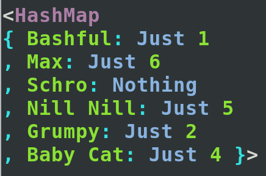
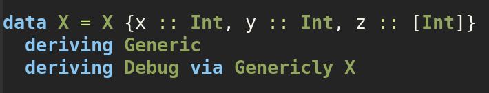
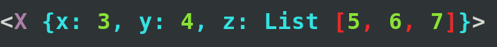
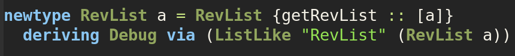
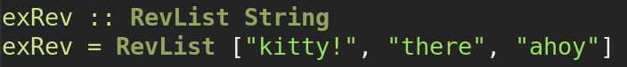

# debugged

An implementation of debug pretty printing library inspired by [purescript-debugged](https://github.com/hdgarrood/purescript-debugged).

# Features

  - ASCII coloured output:

    
    
  - Generic deriving:

    We can declare a data type each of the fields having instances of debugged:

    

    And then using [Deriving Via](https://ghc.gitlab.haskell.org/ghc/doc/users_guide/exts/deriving_via.html)
    we get pretty printed output for free:

    
    
  - Newtypes for use with [Deriving Via](https://ghc.gitlab.haskell.org/ghc/doc/users_guide/exts/deriving_via.html) (using type level symbols):

    We can declare a data type of reverse lists (implemented here as a newtype for lists)
    along with giving a Foldable instance (not shown here):

    

    Then given some reverse list:

    

    We get pretty printing including the type name:

    
  
